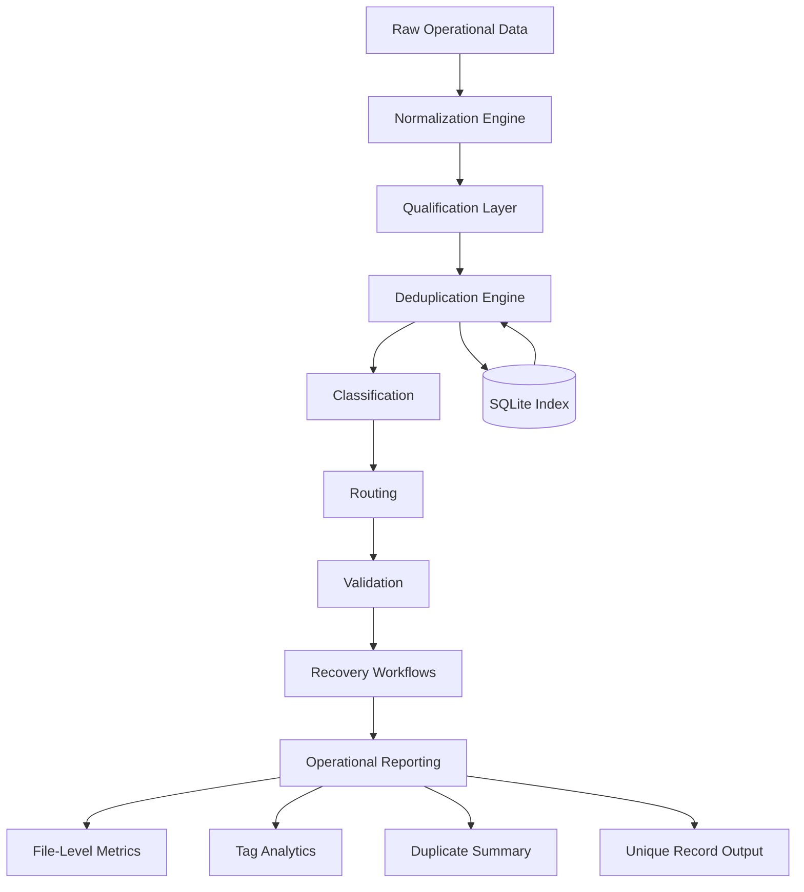

# ShadowOps Data Pipeline

## Operational Data Engineering Platform

**Architected to automate large-scale data processing, workflow orchestration, deduplication, validation, and operational decision support.**

---

# Executive Summary

ShadowOps Data Pipeline is an operational data engineering platform developed to transform complex, repetitive, and large-scale data processing into reliable, repeatable automation.

The repository represents a collection of production-oriented Python automation modules that work together to organize, normalize, classify, deduplicate, validate, and analyze operational datasets containing tens of millions of records.

Rather than functioning as isolated scripts, these modules were engineered as components within a larger processing architecture where every stage has a defined operational purpose.

The objective is straightforward:

- Reduce manual effort
- Improve consistency
- Increase processing speed
- Preserve data integrity
- Scale operations through automation

---

# Why This Platform Exists

Large operational datasets present recurring challenges:

- Duplicate records
- Inconsistent formatting
- Fragmented workflows
- Manual validation
- Slow processing
- Limited visibility
- Difficult recovery procedures

Traditional manual workflows become increasingly unreliable as datasets grow.

ShadowOps Data Pipeline was developed to replace repetitive manual processing with deterministic, repeatable automation capable of operating across millions of records.

---

# Engineering Philosophy

Every operational workflow eventually reaches a point where people become the bottleneck.

The solution is not to work harder.

The solution is to engineer better systems.

Every module within this repository exists because an operational problem was identified, analyzed, and automated.

The emphasis is not on writing scripts.

The emphasis is on designing reliable operational systems.

---

# Platform Objectives

The platform was engineered around five principles.

## 1. Automation

Remove repetitive manual work wherever possible.

## 2. Reliability

Produce repeatable processing with deterministic results.

## 3. Scalability

Design workflows capable of handling very large datasets.

## 4. Visibility

Generate reporting that allows operators to understand processing outcomes.

## 5. Recoverability

Prefer conservative decisions that protect data integrity whenever uncertainty exists.

---

# High-Level Processing Architecture

