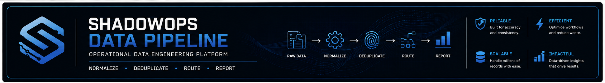
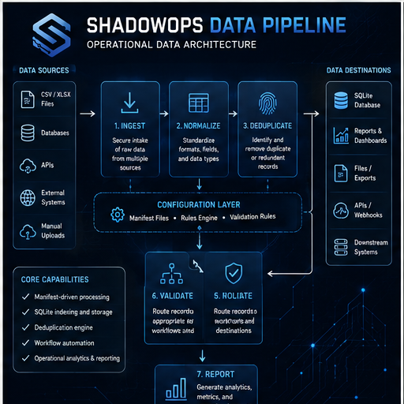
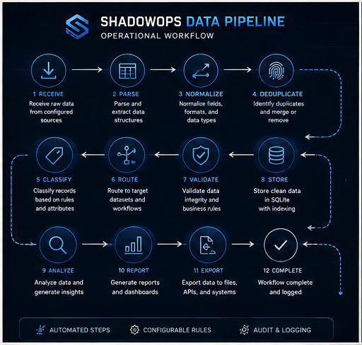

<p align="center">
  
</p>

# ShadowOps Data Pipeline

## Operational Data Engineering Platform

**A modular Python platform for large-scale data processing, workflow automation, record normalization, deduplication, validation, routing, and operational reporting.**

---

# Executive Summary

ShadowOps Data Pipeline is a production-oriented operational data engineering platform designed to automate complex, repetitive, and high-volume data workflows.

Rather than functioning as a collection of standalone scripts, the repository represents an integrated processing pipeline where each module performs a defined operational responsibility within a larger architecture.

The platform was engineered to process very large datasets while improving consistency, reducing manual effort, preserving data integrity, and providing repeatable operational outcomes.

Its design emphasizes modularity, scalability, recoverability, and engineering discipline.

---

# Why This Platform Exists

Operational organizations routinely process datasets containing hundreds of thousands or millions of records. As data volume grows, manual processing becomes increasingly difficult to maintain.

Common operational challenges include:

- Duplicate records
- Inconsistent formatting
- Manual classification
- Fragmented workflows
- Validation bottlenecks
- Recovery complexity
- Limited reporting
- Slow processing cycles

ShadowOps Data Pipeline was built to replace those manual activities with structured, repeatable automation.

---

# Engineering Philosophy

Every operational workflow eventually reaches a point where people become the bottleneck.

The objective is not simply to automate tasks.

The objective is to engineer systems that are predictable, maintainable, observable, and capable of supporting long-term operational growth.

Every module in this repository exists because an operational problem was identified, analyzed, and engineered into a repeatable workflow.

---

# Platform Objectives

The platform was designed around five engineering principles.

## Automation

Replace repetitive manual work with deterministic processing.

## Reliability

Produce consistent results regardless of dataset size.

## Scalability

Support workflows operating across millions of records.

## Visibility

Generate operational reporting that supports informed decision-making.

## Recoverability

Protect data integrity by favoring conservative recovery and validation processes.

---

# High-Level Architecture

<p align="center">
  
</p>

The architecture separates processing into independent stages, allowing each module to perform a focused operational responsibility while remaining part of a larger automated workflow.

Core processing stages include:

- Data ingestion
- Normalization
- Qualification
- Deduplication
- Classification
- Routing
- Validation
- Recovery
- Reporting

---

# Operational Workflow

<p align="center">
  
</p>

A typical execution flow follows this sequence:

1. Import operational datasets
2. Normalize records
3. Apply qualification rules
4. Detect duplicate records
5. Classify qualifying data
6. Route records into operational groups
7. Validate processing results
8. Execute recovery workflows where required
9. Generate operational reports and analytics

---

# Repository Structure

```text
shadowops-data-pipeline/
│
├── banner-data-pipeline.png
├── architecture-data-pipeline.png
├── workflow-data-pipeline.png
│
├── shadowops_dedup_engine.py
├── RESUME_STATE_ROUTER.py
├── run_C1_forensic_compare.py
├── run_section_compare.py
│
├── images/
│   └── .gitkeep
│
├── README.md
├── LICENSE
└── .gitignore
```

---

# Core Components

### `shadowops_dedup_engine.py`

A manifest-driven deduplication engine that normalizes records, generates SHA-1 fingerprints, stores persistent record indexes in SQLite, tracks duplicate records, and produces operational summaries.

### `RESUME_STATE_ROUTER.py`

A state-routing utility designed to resume and continue structured geographic processing across large operational datasets.

### `run_C1_forensic_compare.py`

A large-scale forensic comparison engine that builds a persistent SQLite reference index and evaluates an entire file environment for redundant, unique, invalid, or unreadable data.

### `run_section_compare.py`

A targeted comparison utility that evaluates one selected operational section against the trusted reference dataset and produces file-level match, unmatched, and deletion-safety results.

---

# Technology Stack

## Languages

- Python

## Data

- SQLite
- CSV
- Text Processing
- Record Fingerprinting
- Persistent Indexing

## Engineering

- Workflow Automation
- Operational Analytics
- Data Engineering
- Record Classification
- Validation Pipelines
- Deduplication
- Recursive File Processing
- Batch Processing
- Progress Telemetry

---

# Engineering Highlights

- Modular processing architecture
- Manifest-driven execution
- Persistent SQLite indexing
- SHA-1 record fingerprinting
- Record normalization
- Batch transaction handling
- Duplicate tracking
- File-level and global reporting
- Conservative recovery logic
- High-volume data processing
- Long-running process visibility
- Engineering-first design philosophy

---

# Operational Use Cases

The platform is applicable to organizations requiring reliable processing of large operational datasets, including:

- Lead database management
- Data migration
- Data quality initiatives
- Operational reporting
- Workflow automation
- Record validation
- Duplicate detection
- Data recovery
- Large-scale file processing
- Section-level forensic comparison

---

# Future Roadmap

Planned areas of expansion include:

- Configuration-driven workflows
- Command-line interfaces
- Parallel processing support
- Structured logging
- Automated testing
- REST API integration
- Dashboard visualization
- Enhanced reporting
- Additional validation modules
- Cloud deployment options
- Containerized execution
- Sample datasets and demonstrations

---

# Security Note

SHA-1 is used in this project as a fast record-equality fingerprint.

It is not used for passwords, authentication, encryption, or security-sensitive storage.

No private operational datasets are included in this repository.

---

# Author

**Patrick Estrada**

Systems Architect  
Automation Engineer  
Operational Software Engineer  
AI-Assisted Development  
Mission-Critical Operations

---

# License

Released under the MIT License.

See the `LICENSE` file for additional information.
